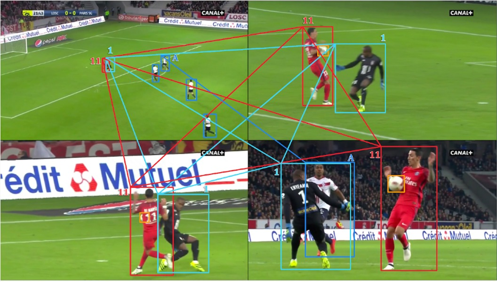
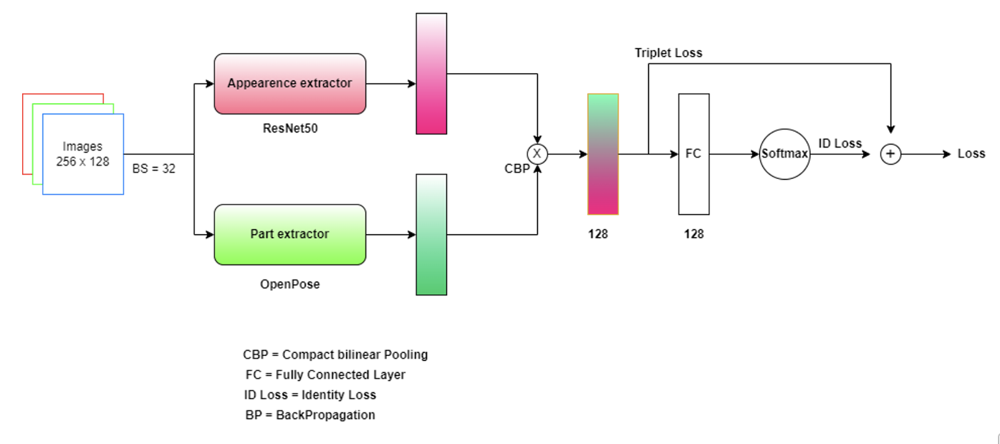
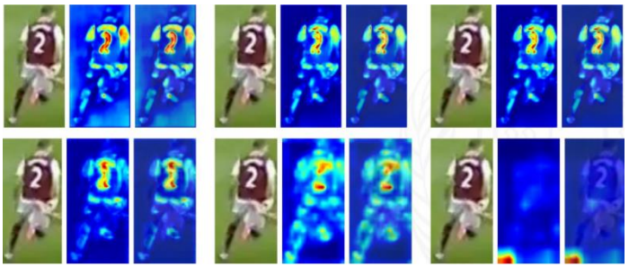
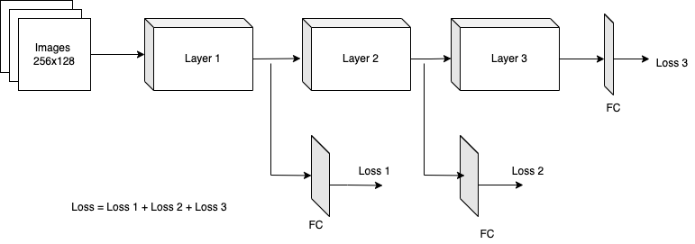

# Soccerplayer Re-Identification
This repository is our submission to [SoccerNetv-3 Re-identification challenge](https://www.soccer-net.org/tasks/re-identification). 

SoccerNet Re-Identification (ReID) is part of the SoccerNet-v3 dataset, which is an extension of SoccerNet-v2 with new and challenging tasks including 
action spotting, camera shot segmentation with boundary detection, replay grounding, calibration, multi-view player re-identification and multi-player tracking.
Please visit [SoccerNetv3 official website](https://www.soccer-net.org/) for more information about other challenges.

## Challenge description
The goal of the challenge is to re-identify soccer players across multiple camera viewpoints depicting the same action during the game. The first frame in which the action has been seen in the broadcast video as the "action frame".
The other frames depicting the same action (at roughly the same timestamp), and appearing later in the broadcast video, are called the "replay frame".
The goal of the challenge is to re-identify each soccer player in the action frame across the different replay frames. 
For that purpose, each bounding box from a given action frame will be considered as a query, and bounding boxes from the corresponding replay frames will be ranked according to their distance to each query.
Below is the example of the player association in the SoccerNetv3 dataset.

## Method
Compared to traditional street surveillance type re-identification dataset, the SoccerNet-v3 ReID dataset is particularly
challenging because soccer players from the same team have very similar appearance, which makes it hard to tell them apart.
On the other hand, each identity has a few number of samples, which render the model harder to train.
There is also a big diversity in image resolution.

One of the main ideas behind our solution is that compared to all the traditional re-identification datasets such as Market1501, Duke-Reid etc. the time gap between images of same identity is almost zero, which mens we could use positional features as discriminative cue, mush so when appearance features are not sufficient to discriminate the identities.   

### A. Appearance extractor
Appearance extractor works on extracting the appearance 
features of the image. We train the *RESNET-50* model for 
this task which is initialized with pretrained weights learnt 
on the classification task of the *Zoo* dataset.

### B. Part extractor
Part extractor works on extracting the spatial features of 
body parts in an image which capture the positional features of the players. We do not need any annotations of body parts for this task 
as we train the subnetwork of OpenPose which is 
initialized with pretrained weights on the task of pose 
estimation on COCO dataset. For more detailed information look at the [report](images/abhishek_kumar_mahesh_bhosale_soccer-reid.pdf).

### C. Bilinear Pooling
we bi-pool the features from both the streams (appearance and part), which 
simply means taking the outer product to allow finer 
interactions of the features. We use *Compact Bi-linear pooling* which is compute efficient way of bi-linear pooling as outer product is taken on dimensionally reduced vectors.  

###Layer-wise Similarity
In the Deep CNNs lower layers can identify some low-level 
features such as shape and edges while upper layers capture 
the high-level features.

As can be seen in activations maps, 
activations of the last layer of *RESNET-50* do not reveal much information, 
so we are also interested in the features extracted at some 
previous layers of *RESNET-50*. Therefore, we calculate the layer wise similarity as shown below,

## Citations
- [Soccernet official website](https://soccer-net.org/)
- [Torchreid](https://github.com/KaiyangZhou/deep-person-reid)
- [Openpose](https://arxiv.org/pdf/1812.08008.pdf)
- [Part-aligned bilinear for person reindentification](https://cv.snu.ac.kr/publication/conf/2018/reid_eccv18.pdf)
- [Compact Bilinear Pooling](https://arxiv.org/pdf/1511.06062.pdf)
- [Bilinear pooling](https://arxiv.org/pdf/1504.07889.pdf)
